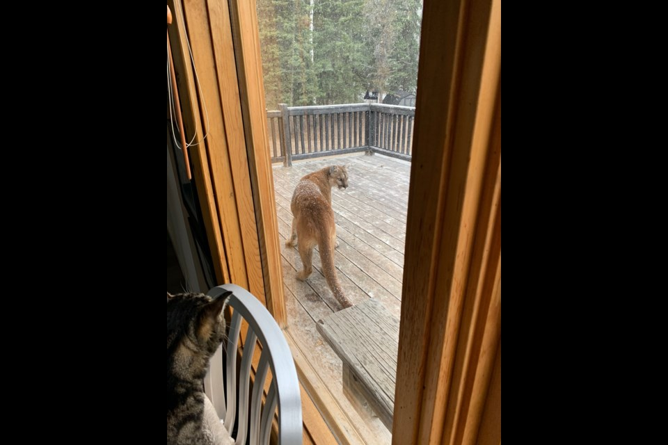

# Evaluating Multimodal LLM's Use in Home Safety Monitoring

*last updated February 3, 2024*

This article introduces a set of test scenarios aimed at gauging the performance of a Large Multimodal Model (LMM) as an  **vision component of a fictitius home robot**, named GuardianBot. In these scenarios, the LLM takes on the role of a protector, with the responsibility to keep members of the household safe by spotting hazards and threats.

The primary objective of these tests is to evaluate whether a given LMM has the **commonsense capacity** to identify **any scenarios in a household that may require further attention**, so that a certain people in charge can be notified. 

# Table of Contents
1. Test Summary
2. Test Cases
3. Status of This Project
4. Other Resources

## Test Summary

Following is a quick summary of the tests. Overall the GPT-4V model has performed very well in the following scenarios:

- Capability to comprehend subtle situations. For instance:
    - An open flame resulting from cooking (such as the flambéing technique) is acceptable, but an uncontrolled flame necessitates immediate action.
    - A large lion in the house is okay if the person nearby seem unalarmed, but ...
- Able to make commonsense assessment on the severity of a hazard. For example, [fire in the kitchen](#user-content-case-fire-in-the-kitchen) case, the GuardianBot is able to decide that it is urgent and require immediate attention.
- Understanding priorities. For example, in the [fire in the kitchen](#user-content-case-fire-in-the-kitchen) case, when given three candidate persons to notified for a fire hazard, the GuardianBot choose the nearest person first.

<!-- (#user-content-case-fiery-dish) -->

## Test Parameters

* The test results listed below are mainly derived using OpenAI's GPT-4V model. At this time results from Googel Bard/Gemini are much more limited, due to problem where Bard/Gemini often refuses to process a given image. 
* For the purpose of this study, issues such as cost and efficiency are intentionally ignored.
* Note that multimodal LLM supports interactive query, which is invaluable when the case in question is complicated or confusing.

## Test Cases

Following is a list of test cases that cover a variety of home scenarios.

Note that the emphasis in the responses given below are mine.

### Case: fire in the kitchen

- Notes: unattended and seemingly out-of-control fire. Contrast this with the controlled fire scenario below.
- Response from OpenAI GPT-4V: This image shows a **dangerous situation**: there is a fire in a pan on a stove, which is a common kitchen hazard. Immediate action is required. If you are in the vicinity, here are the steps you should take:

    - Do not attempt to move the pan outside, as this can spread the fire.
    - Turn off the stove burner if it's safe to do so.
    - If you have a metal lid or cookie sheet, slide it over the pan to cover it completely and smother the flames. Do not use glass as it can shatter.
    - You can also use a class K fire extinguisher suitable for kitchen fires if available.
    - Do not use water to extinguish the fire as this can cause the oil to splatter and spread the fire.
    - If the fire does not go out immediately or if it starts to spread, evacuate the area and call emergency services right away.

    For future prevention, it's important to never leave cooking unattended, keep flammable materials away from the stove, and have a functioning smoke detector installed in your kitchen. If this alert is coming from a home mobile robot, it should be programmed to alert the residents immediately and, if possible, activate a built-in fire suppression system or call emergency services.

### Case: fiery dish

- Notes: contrast this with the uncontrolled fire above, to see if system can tell the two apart. Also demonstrated that GuardianBot's overly cautious advice can be tweaked with further dialog.
- Response from OpenAI GPT-4V: The image shows an individual cooking with a pan that has caught fire. Despite the person's smile, this is a serious situation and immediate action should be taken to address the fire.

    Here's what to do if you're present:

    - Stay calm. Panicking can make the situation worse.
    - Turn off the stove if it's safe to do so without moving the pan.
    - If the fire is small, cover the pan with a metal lid or a larger pan to deprive it of oxygen.
    - Do not attempt to extinguish the fire with water, as this can cause a grease fire to spread.
    - If the fire does not go out quickly, use a fire extinguisher suitable for grease fires, typically a Class K extinguisher in the United States.
    - If the fire is out of control, evacuate the premises and call emergency services immediately.

    Do not underestimate the danger of a kitchen fire, even if it appears small. It can quickly grow and spread, becoming a threat to life and property. If a home robot equipped with GuardianBot capabilities detects this situation and human intervention is not immediate, it should alert the household and, if necessary, contact emergency services.
- Follow-up Q&A:
    - User: FYI, people in this hold love to cook, and seeing flames in cooking pan is commonplace. Please adjust recommended actions based on this additional information.
    - GPT-4V: Understood, if open flames are a common and controlled part of cooking practices in this household, such as when flambéing dishes, the approach to the situation should be adjusted accordingly.

    It's important to ensure that the following safety measures are in place:

    - Ensure there is a clear space around the stove, free of flammable materials.
    - Keep a fire extinguisher, preferably a Class K extinguisher, within easy reach.
    - The individual cooking should have a proper knowledge of fire safety and how to handle flames in the kitchen.
    - There should be a working smoke detector in the kitchen to alert in case the fire becomes uncontrolled.
    - Regularly check and maintain the stove and kitchen equipment to prevent accidental fires.

    As long as the person is attentive and appears to be in control of the cooking process, GuardianBot **would not need to take immediate action**. However, it should continue to monitor the situation closely and be ready to alert the household or call for emergency assistance if the fire seems to get out of control or if the cook appears to be in distress

### Case: sleeping

- Notes: 
- Response from OpenAI GPT-4V: I have identified an individual lying on the floor with their upper body obscured beneath a couch. This positioning may be indicative of distress or an unusual situation. If you are physically present with this person, please **check on their well-being immediately**. Ask if they are okay, and if they are unresponsive, you may need to call emergency services.

    If the person is responsive but appears to be in distress, it's important to offer assistance and inquire if they need any help. They might require medical attention or may have fallen and need assistance getting up.

    Should this be a monitoring alert from a home mobile robot, it would be appropriate for the robot to approach and use its onboard systems to assess the person's consciousness and health status, potentially notifying family members or emergency services as programmed or as the situation requires.

### Case: senior in distress

- Notes: this is a baseline test for detecting household member in distress
- Response from OpenAI GPT-4V: \
    Section 1: Observations

    The individual appears to be an elderly person who has fallen and is showing signs of distress or pain.
    They seem to be reaching out, possibly for support or because of an inability to get up.
    The environment is a domestic interior with hard flooring, which could contribute to injury during a fall.

    Section 2: Recommended Actions

    If the robot is capable, assist the individual to a safe and comfortable position, if not, provide support or cushioning to prevent further injury.
    Provide reassurance to the individual and assess for any visible injuries or complaints of pain.

    Section 3: Send Alert

    CALL 911: Given the individual's apparent age and distress, as well as the potential for injury from a fall, emergency services should be contacted immediately to ensure professional medical care is provided.

### Case: cougar on deck

- Notes: test correct identification of large wild animal around house. Note that in this case the GPT-4V foundation model has mis-identified the animal as a dog. This issue is studied in a separate report.
- Response from OpenAI GPT-4V: 

    Section 1: Observations

    > There is a **dog** outside on a wet deck, potentially in the rain, and a cat inside looking at the dog through a glass door.
    The dog appears to be wet and may have been outside for a while.
    The weather appears to be poor, which could lead to the dog becoming cold or ill if left outside for too long.

    Section 2: Recommended Actions

    > Allow the dog inside to shelter from the weather and to dry off.
    Ensure both pets have access to water and a warm, safe space.

    Section 3: Send Alert

    > ALERT: Notify the owner so they can ensure the dog is taken care of and is not left outside in bad weather. This is not urgent, but should be addressed when convenient.

<!--
### Case: 

- Notes: 
- Response from OpenAI GPT-4V: 
-->

## Status of This Project

The test cases are still being collected, and undergo constant update.

## Other Resources

- A separate collection of test cases intended for use to evaluate an LMM as the driver of a Level 5 autonomous car is available [HERE](https://github.com/kaihuchen/AutonomousBackseatDriver/blob/main/README.md).

